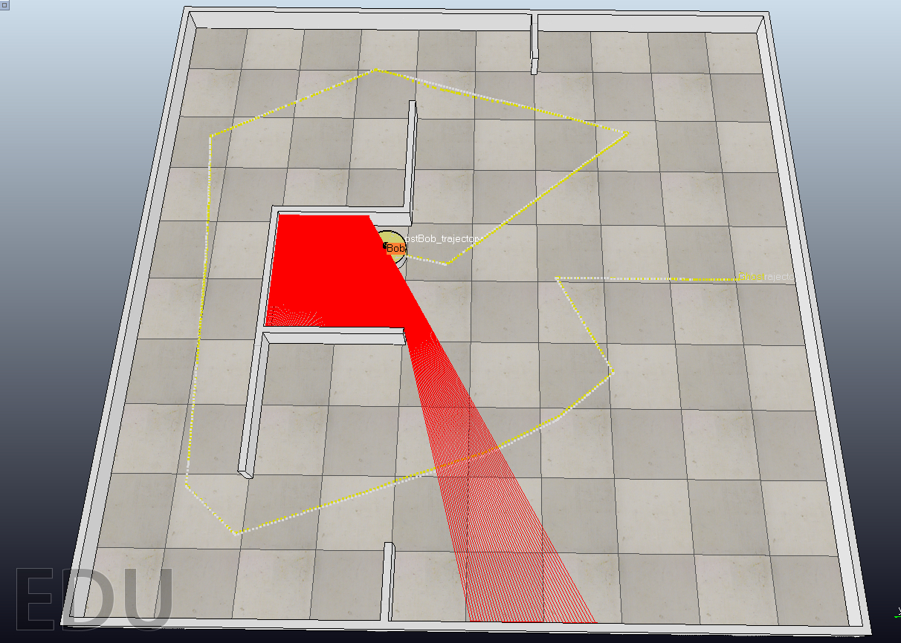
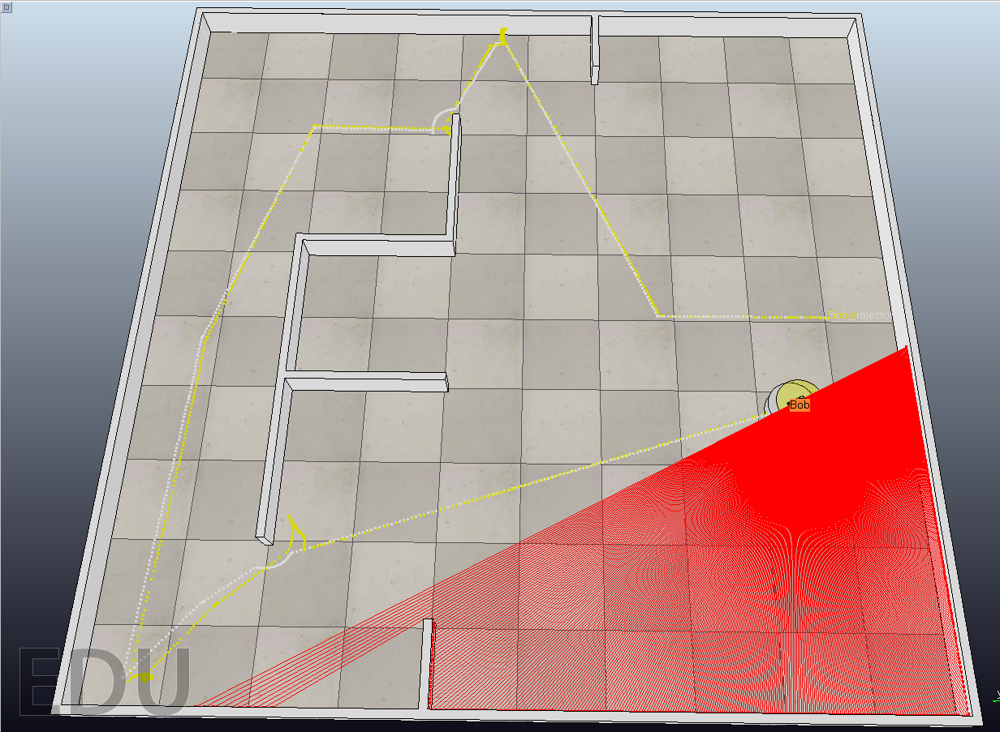

# Line-Based EKF SLAM System for Indoor Environment

## Introduction:

This project implemented an EKF SLAM system for indoor differential robot, which use laser range finder as its main sensor. Assume no prior knowledge of environment, can simultaneously build a map of lines and localize robot, no limitation of map size. 

## Simulation Environment: 

This project V-REP 3.5.0 as the simulation environment, the scene file is provided in scene/scene.ttt 

## Build Requirement 

Built and tested on Ubuntu 16.04

Dependencies: 

1. ROS Kinetic 

2. Eigen: 3.3.5

## Result:

The white line is ground truth of robot trajectory, and the yellow line is posterior estimation of robot trajectory. 

#### Figure 1 Normal trajectory  

#### Figure 2 Trajectory with unexpected collision

The trajectory contains four unexpected collision. When collision occurs, the posterior estimation will not be accurate as normal, but the system can recover from collision error afterwards, which shows the robustness of the system

